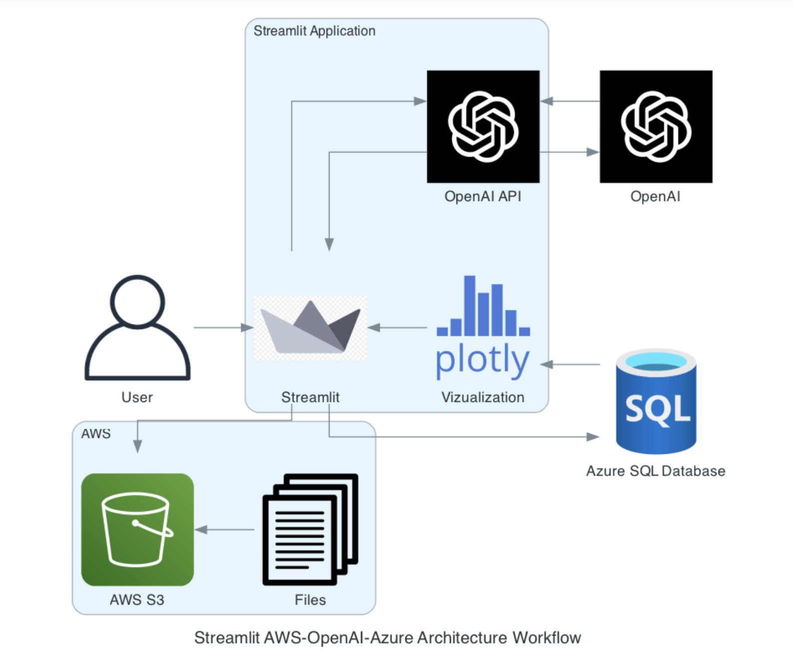
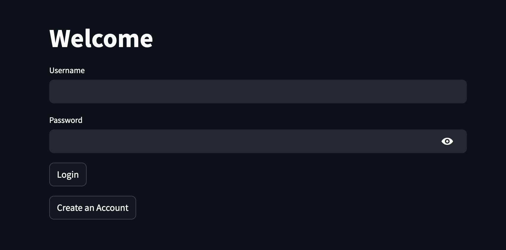
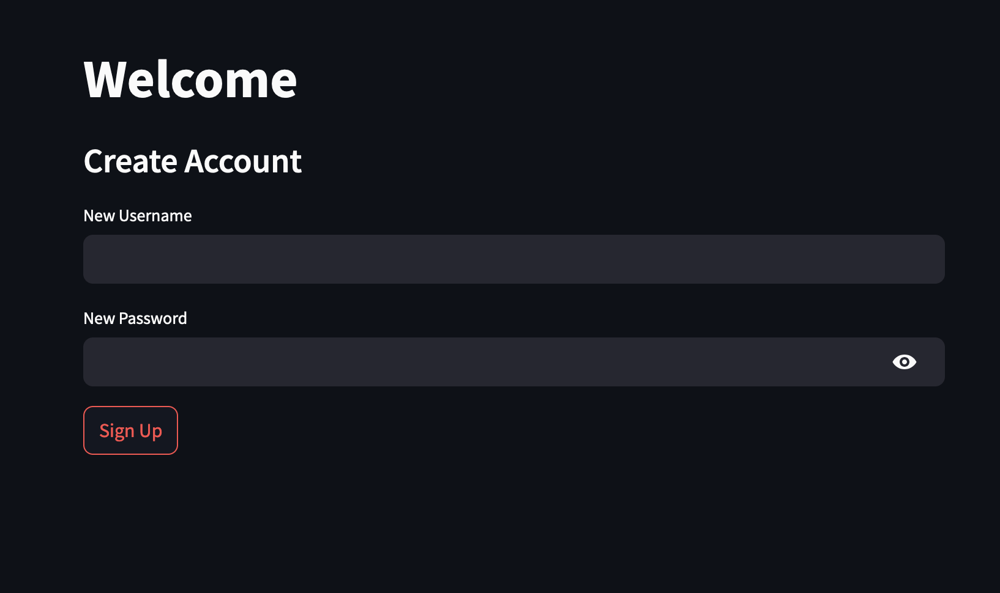
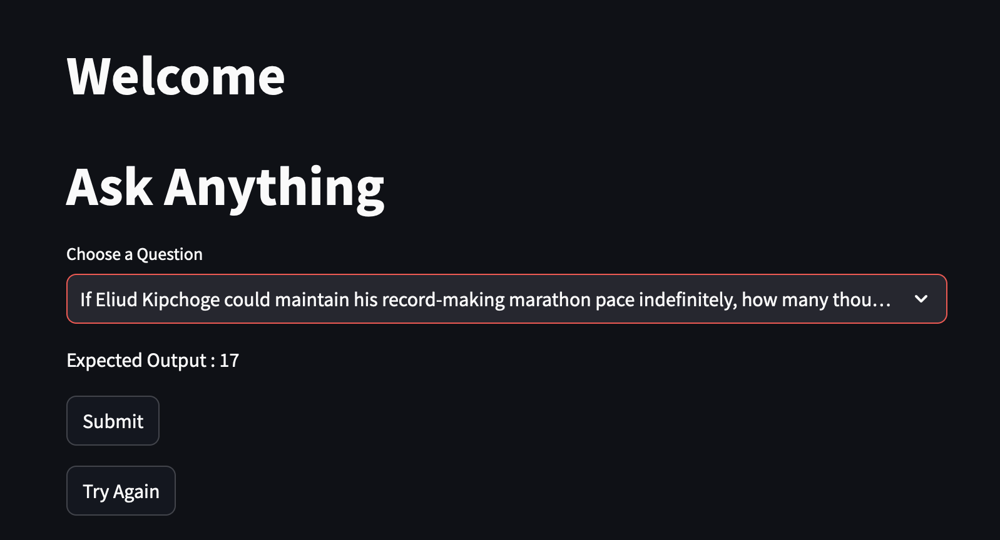
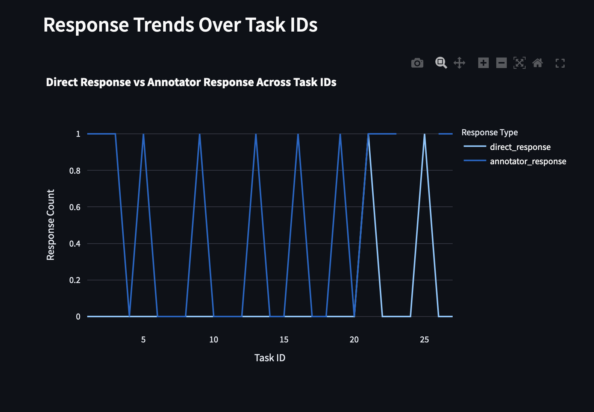
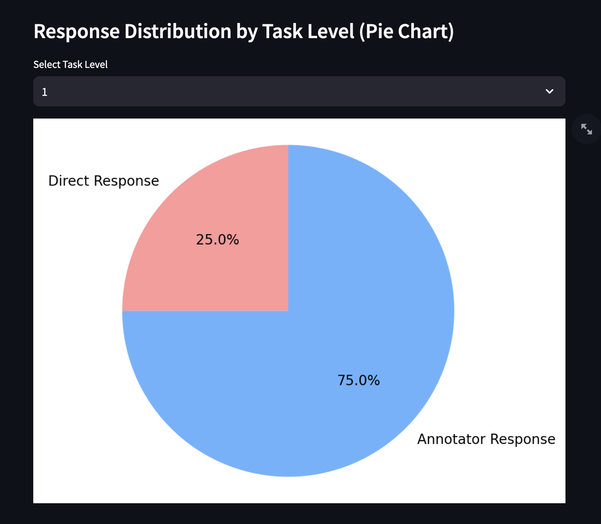
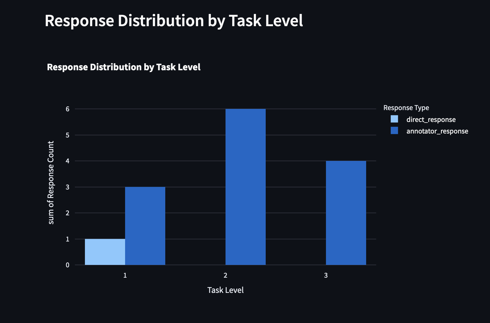

# Assignment1
# About
## Links
1. [Diagrams](#diagrams)
2. [Codelabs Document](https://codelabs-preview.appspot.com/?file_id=12x51PlTxUmD6F9uAui8ZyoWTlUt4VTFP3YCYAvrLZq4)
3. [Video of the submission](https://youtu.be/hQujEXRkhJw)
4. [Working app](https://intelligentapp.streamlit.app/)
5. [Github URL](https://github.com/BigData-Fall2024-TeamA3/Assignment1/tree/main)

## Diagrams

### Architecture


### UI

#### Login page


#### Sign up page


#### User chat Interface



### Visualizations

#### Response trend


#### Response distribution by difficulty level


#### Response distribution by difficulty level



# Setup instructions

## Pre-reqs

Poetry, ODBC driver for sql server (msodbcsql17), tesseract

## Steps

1. clone repo

```

git clone git@github.com:BigData-Fall2024-TeamA3/Assignment1.git

```

  

2. Install dependencies

```

poetry install

```

3. Create .streamlit/secrets.toml file for following

```

OPENAI_API_KEY = ""

s3_file_key_path = "path/to/your/files/"

bucket_name = ''

s3_file_key = 'path/to/your/metadata.jsonl'

s3_file_url = ''

aws_access_key_id = ''

aws_secret_access_key = ''

  

# Azure Connection details

server = ''

database = ''

username = ''

password = ''

driver = ''

  

```

  

4. Run streamlit app

```

poetry run streamlit run app.py

```


# References

1. https://docs.streamlit.io/develop
    1. https://docs.streamlit.io/develop/tutorials/multipage
    2. https://docs.streamlit.io/develop/api-reference/charts/st.plotly_chart
    3. https://docs.streamlit.io/develop/tutorials/databases/aws-s3 
2. https://learn.microsoft.com/en-us/azure/azure-sql/?view=azuresql
3. https://boto3.amazonaws.com/v1/documentation/api/latest/guide/s3-examples.html
4. https://github.com/openai/openai-python
5. https://docs.google.com/document/d/12x51PlTxUmD6F9uAui8ZyoWTlUt4VTFP3YCYAvrLZq4/edit?usp=sharing
6. https://github.com/openai/openai-python/tree/main/examples